<div align="center">


# SecureSight AI

**A conversational security information and event management (SIEM) workspace**

Upload logs, investigate detections, triage incidents, and create reports from one dashboard.

[Get started](#quick-start) · [Screenshots](#screenshots) · [Architecture](#architecture) · [Documentation](#documentation)

</div>

> **Project scope:** SecureSight AI is a final-year B.Tech project. Threat detection uses rules and event correlation. Gemini assists with questions about the user's stored SIEM aggregates; it does not decide whether an event is malicious.

## What it does

| Area | Capability |
| --- | --- |
| Log ingestion | Upload supported SSH, web server, syslog, CSV, and JSON logs; parse and normalize events. |
| Detection | Apply signatures and correlate related events, including events from earlier uploaded files. |
| Investigation | Review dashboard trends, search events, inspect evidence, and resolve or mark alerts as false positives. |
| AI assistant | Ask follow-up questions using bounded, user-scoped database summaries; conversations persist. |
| Reporting | View security posture and incident response summaries; export the posture PDF or alert CSV, or print the incident response view to PDF. |
| Accounts | Sign in, manage a profile, and recover a password with a one-time recovery code. |

## Screenshots

**Security overview** — metrics and activity shown here come from an uploaded log file; values change with the data.

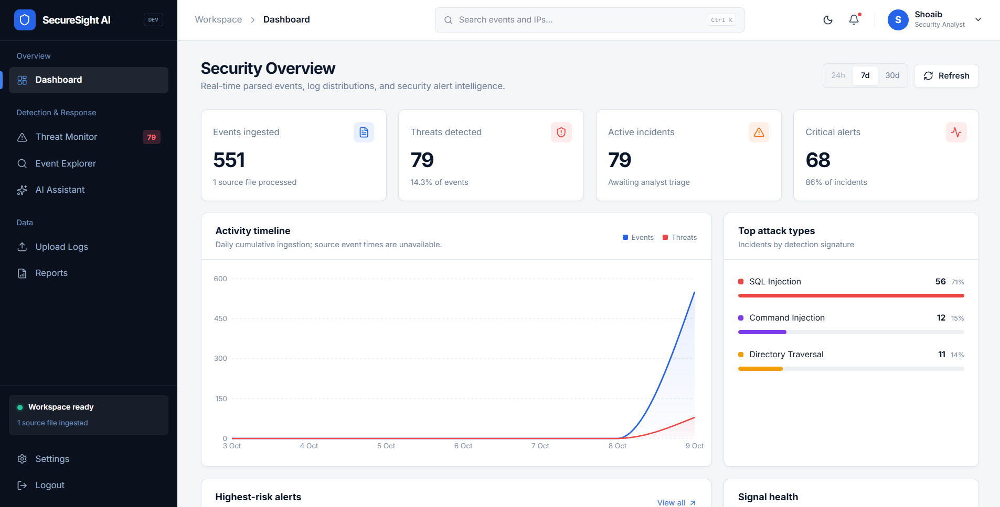

<details>
<summary><strong>Explore the full interface</strong> · 11 more screens</summary>

| Access and account recovery | Investigation workspace |
| --- | --- |
| **Login**<br>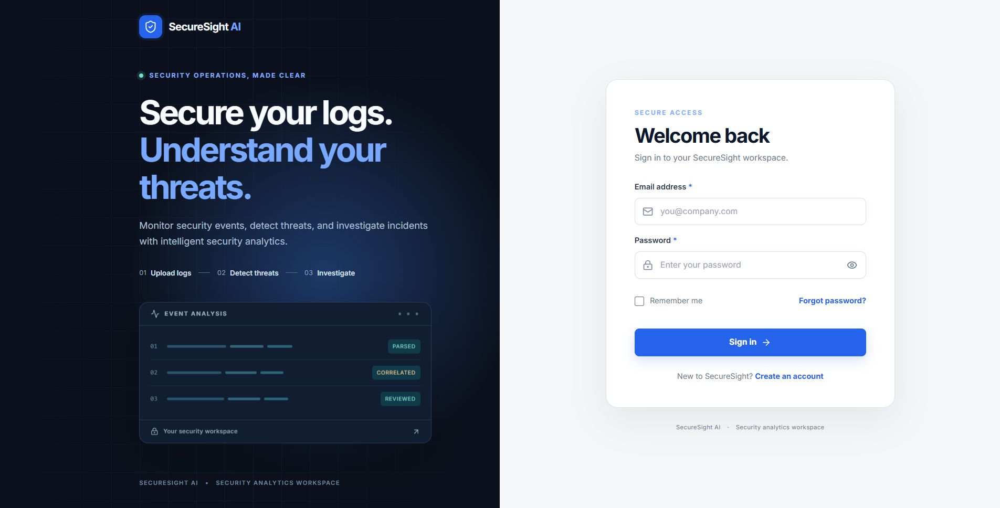 | **Upload logs**<br>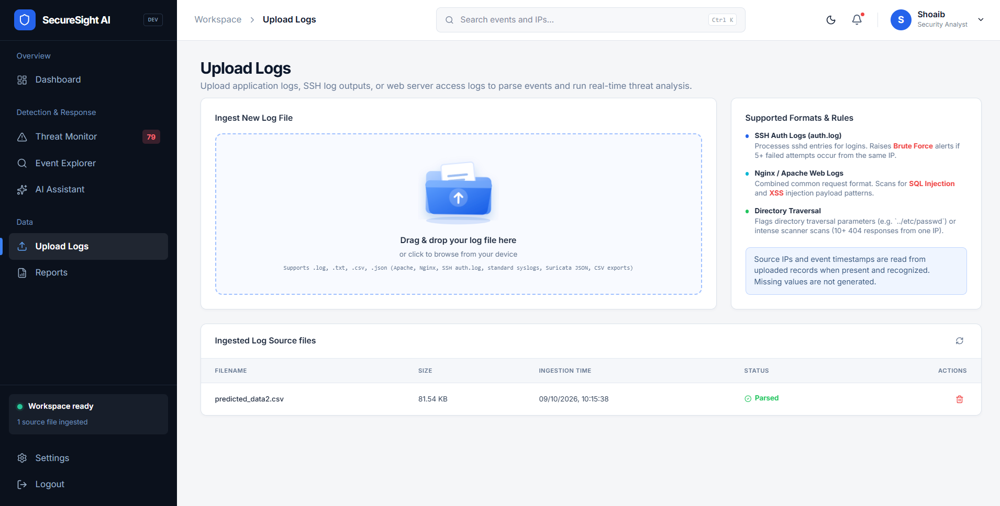 |
| **Signup**<br>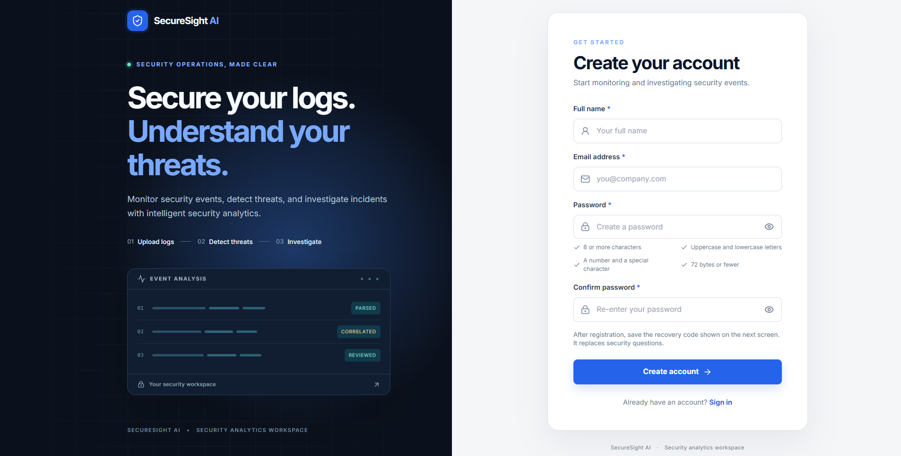 | **Event Explorer**<br>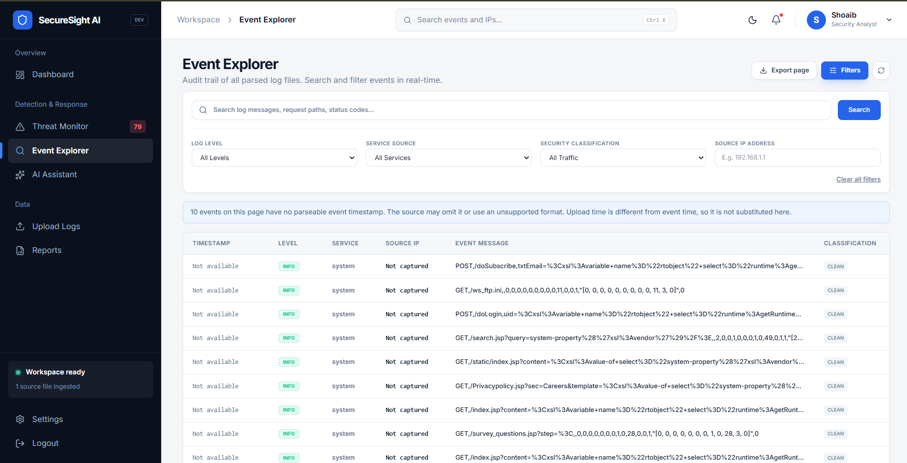 |
| **Account recovery**<br>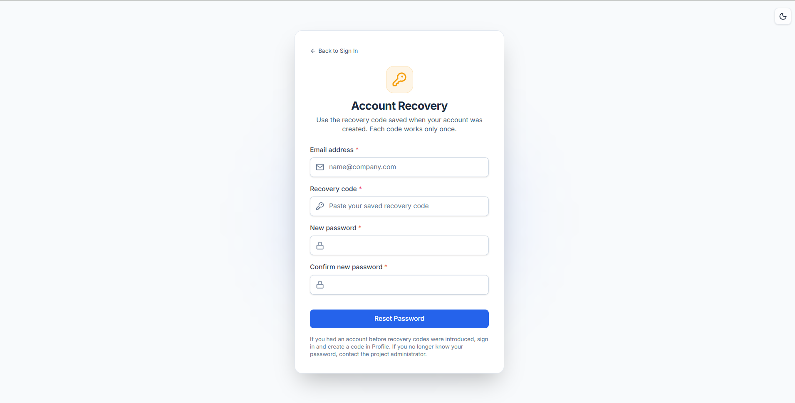 | **Threat Monitor**<br>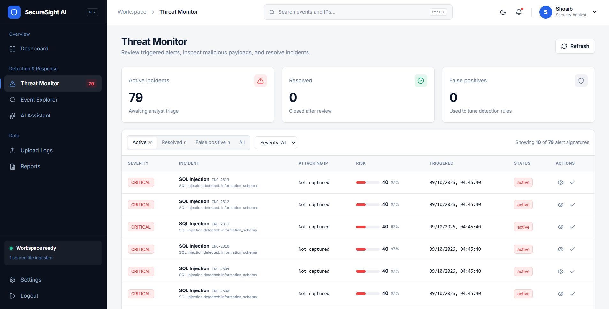 |
| **Settings**<br>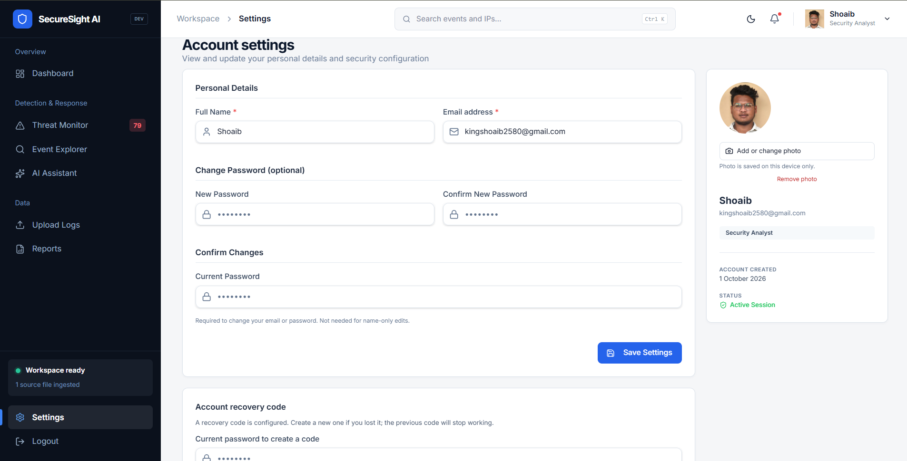 | **Incident details**<br>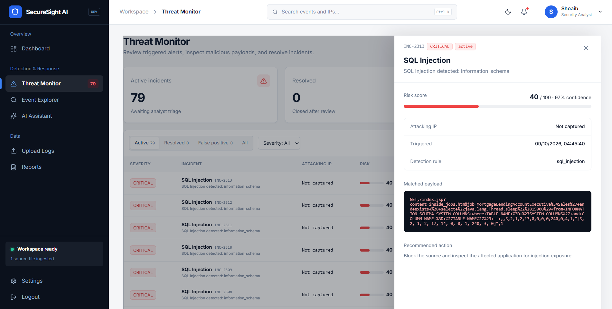 |
| **AI Assistant**<br>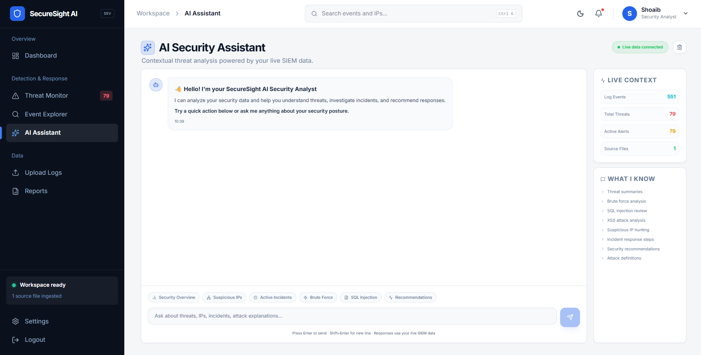 | **Security posture report**<br>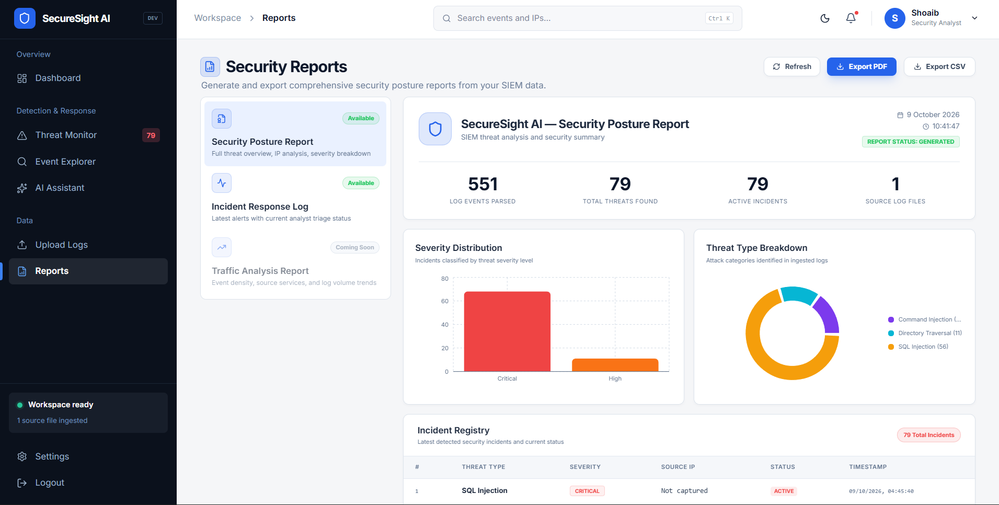 |
| **Incident response report**<br>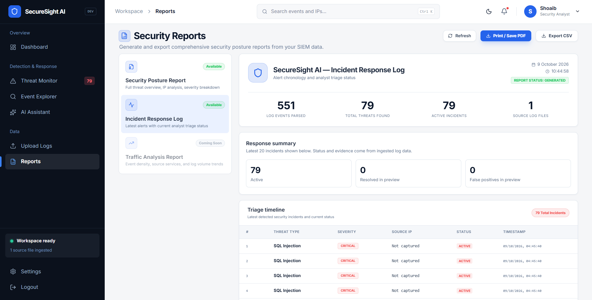 | |

</details>

## Architecture

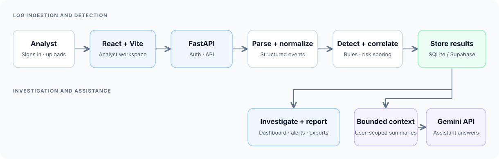

The operational path is **sign in → upload → parse → normalize → detect → store → investigate → triage → report**. The backend owns authentication, detection, persistence, Gemini calls, and exports. The frontend provides the analyst workspace. SQLite supports local development; Supabase PostgreSQL is available for hosted storage.

The assistant sends bounded counts and grouped summaries to Gemini, excluding raw log messages and alert evidence. See the [architecture notes](docs/architecture/overview.md) for module responsibilities and data relationships.

## Technology

| Layer | Tools |
| --- | --- |
| Frontend | React 19, Vite 8, Tailwind CSS 4, Recharts, Lucide icons |
| Backend | Python, FastAPI, Pydantic, SQLAlchemy |
| Storage | SQLite locally; Supabase PostgreSQL through `psycopg` |
| Assistant | Server-side Gemini integration |
| Reports | ReportLab PDF generation and CSV export |
| Checks | Python `unittest`, Oxlint, Vite production build |

## Quick start

**Prerequisites:** Python 3.13, Node.js 22, and npm. These PowerShell commands start from the repository root.

### 1. Backend

```powershell
python -m venv venv
venv\Scripts\python.exe -m pip install -r backend\requirements.txt
Copy-Item .env.example .env
```

The example `.env` uses SQLite. Set a strong `SECRET_KEY` before using a shared or deployed instance. Add `GEMINI_API_KEY` to enable live assistant answers. For Supabase, replace `DATABASE_URL` with its PostgreSQL connection URI and follow the [database setup guide](database/README.md). Never commit `.env` or API keys.

Run the backend:

```powershell
venv\Scripts\python.exe -m uvicorn backend.app.main:app --host 127.0.0.1 --port 8000 --no-proxy-headers
```

Open `http://127.0.0.1:8000/docs` for the API documentation.

### 2. Frontend

In a second PowerShell terminal:

```powershell
Set-Location frontend
npm install
npm run dev
```

Open `http://127.0.0.1:5173`. Vite proxies `/api/*` to the local backend on port 8000.

### 3. Try the workflow

Create an account, save the one-time recovery code shown during registration, and upload a file from [`data/samples/`](data/samples/). Then inspect the Dashboard, Event Explorer, Threat Monitor, AI Assistant, and Reports. The code is required for self-service password reset; signed-in users can replace it in Profile.

## Repository map

```text
SecureSight AI/
├── frontend/              React workspace and UI assets
├── backend/
│   ├── app/
│   │   ├── api/            HTTP endpoints
│   │   ├── core/           Authentication and rate limiting
│   │   ├── database/       Sessions and schema setup
│   │   ├── detection/      Rules, correlation, and risk scoring
│   │   ├── parsers/        Log formats and timestamps
│   │   └── services/       Normalization and Gemini client
│   └── tests/             Backend regression tests
├── data/samples/          Demonstration log files
├── database/              Storage and Supabase guidance
├── docs/                  Architecture and API documentation
├── scripts/               Verification and migration utilities
└── .env.example           Configuration template
```

## Verification

After installing backend and frontend dependencies, run the complete repository check from the repository root:

```powershell
venv\Scripts\python.exe scripts\verify.py
```

This runs:

1. Backend audit, Gemini, and security regression unittests against an isolated temporary database.
2. Frontend lint.
3. Frontend production build.

Live Gemini and Supabase connectivity need their own credentials and are not exercised by this local check.

## Demonstration data

Upload either file from `data/samples/` through **Upload Logs**:

- `ssh_auth.log`
- `nginx_access.log`

Together they exercise authentication failures, brute-force correlation, SQL injection, XSS, directory traversal, and directory-reconnaissance rules. Detection counts depend on the uploaded data and current rules.

## Documentation

- [Architecture and data flow](docs/architecture/overview.md)
- [API endpoints](docs/api/endpoints.md)
- [Backend guide](backend/README.md)
- [Frontend guide](frontend/README.md)
- [Database and Supabase setup](database/README.md)
- [Sample log guide](data/README.md)
